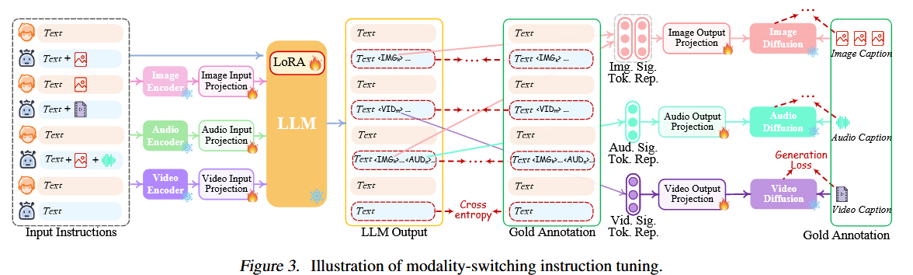

# NExT-GPT: Any-to-Any Multimodal LLM

> ICML 2024 Oral

## 整体框架

## Motivation

- 大多数多模态模型只关注输入端的多模态理解
- 部分模型有训练输出图片和文本交互的LLM
- 现有的any-to-any LLM存在一定的问题：
  - 不同模块之间的信息传递完全基于LLM产生的离散文本，级联过程不可避免地引入噪声并传播错误。
  - 整个系统仅仅利用现有的预先训练的工具进行推理。

## Contribution

- 首次提出一种端到端通用的any-to-any MM-LLM，能够进行语义理解和推理，并生成文本、图像、视频和音频的自由输入和输出组合。
- 引入了轻量级对齐学习技术，编码端以 LLM 为中心的对齐，以及解码端的指令跟随对齐，有效地只需要最少的参数调整（仅 1% 参数），同时保持高效的语义对齐。
- 高质量模态切换指令调整数据集，涵盖文本、图像、视频和音频的各种模态组合的复杂指令

总体实现效果如下图所示：
> 

## Method

### Framework Overview

#### Multimodal Encoding Stage

这里文章利用现有的不同模态的编码器对不同模态的数据进行Encoding操作。文章采用的是**ImageBind**对模态数据进行编码。随后将编码向语义空间对齐。

#### LLM Understanding and Reasoning Stage

文章采用的LLM是**Vicuna (7B-v0)**，这是一款微调过的用于理解视频内容的大模型。LLM 将不同模态的表示作为输入，并对输入进行语义理解和推理。它输出：

- 文本response，用作Lora微调（后续会详细介绍）
- 每种模态的信号标记，用作指示解码层是否生成多模态内容以及如果是则生成什么内容的指令。

#### Multimodal Generation Stage

基于 Transformer 的输出投影层将模态信号标记表示映射为多模态解码器可以理解的表示。从技术上讲，我们采用当前现成的不同模态生成的潜在条件扩散模型，即用于图像合成的稳定扩散**Stable Diffusion**，用于视频合成的 **Zeroscope (v2-576w)** 和用于音频合成的 **AudioLDM**

#### Trainable Params

这相当于 $$\frac{155M(=28+33+31+31+32)}{155M + 12.275B(=1.2+7+1.3+1.8+0.975)}$$，只需要更新 1% 的参数。这也是我们MM-LLM的主要优势之一。

### Encoding-side LLM-centric Multimodal Alignment

**Problems**：通过线性层将多模态特征直接投影到文本特征空间中，从而将多模态特征转换为LLM可以理解的方式。这可能会导致 MM-LLM 的信息感知不理想。原因在于几个方面：

1. **表达能力有限**：线性投影器虽然计算速度快、易于实现且参数少，适合大规模数据处理，但它本质上是一种简单的线性变换方法，这意味着它可能无法捕捉到输入数据之间复杂的非线性关系。

2. **信息损失**：直接通过线性层将多模态特征投影到文本特征空间，可能会导致某些重要的模态特异性信息丢失。因为不同模态的数据有着各自独特的表示形式和信息密度，简单的线性变换可能无法很好地保留这些模态特有的信息。

3. **模态间交互不足**：多模态数据的一个重要特性是不同模态之间的互补性和交互性。线性投影方法可能难以有效地建模这种交互，因为它缺乏一种机制来动态地调整不同模态特征之间的权重和关联。

**Solution**：作者设计了一种可学习的概念标记，通过分组机制将网格级特征分层聚合为语义概念标记，然后将概念表示输入 LLM。

**Accomplishment**：我们利用三种类型的“X-caption”对数据，包括

- “Video-caption”对数据集：**Webvid-2M**（Bain 等人，2021）一个来自库存的带有文本描述的大规模短视频数据集素材网站
- “Image-caption”对数据集：**CC3M**（Sharma 等人，2018），包含超过 300 万张图像，并附有不同风格的自然语言描述
- “Audio-caption”对数据集：**AudioCaps**（Kim 等人，2019），这是一个包含约 46k 音频剪辑的广泛数据集，与通过众包收集的人工编写的文本描述配对。下图说明了学习过程。

### Decoding-side Instruction-following Alignment

**Problems**：我们的主要目的是将扩散模型与法学硕士的输出指令保持一致。然而，在每个扩散模型和LLM之间执行全面的对齐过程将需要大量的工作。

**Solution**：作者设计了解码端指令跟随对齐，如下图所示。  具体来说，设计了三种类型的特殊标记，而不是输出直接的文本指令。

**Accomplishment**：我们考虑将LLM的模态信号标记进行表示（图中Learnable Queries）（在每个基于Transformer的项目层之后）作为去噪过程中的条件输入指导扩散模型生成适当的图像、视频或音频。在对齐训练阶段，我们将来自 CC3M、WebVid 和 AudioCaps 的字幕作为输入，并将它们与信号标记连接起来作为输出。损失函数包含三个关键组成部分：

- **生成信号标记的负对数似然**：它的作用是衡量模型在生成信号令牌时的预测能力。具体来说，它计算的是对于每个信号令牌，模型输出的概率分布与真实标签之间的交叉熵损失。这个loss函数的目的是让模型尽可能地准确地预测出正确的信号令牌。
- **Caption对齐损失**：LLM 生成的信号标记的隐藏状态与从文本编码器导出的条件文本表示之间的 l2 距离在扩散模型中
- **条件潜在去噪损失**：它的作用是在生成信号令牌的同时，保留输入文本中的关键信息。具体来说，它通过比较模型生成的信号令牌和真实信号令牌之间的KL散度来评估模型的性能。这个loss函数的目的是鼓励模型在生成信号令牌的过程中保持与输入文本的一致性，并减少噪声的影响。

### Modality-switching Instruction Tuning

**Goal**：指令调整可以帮助模型更好地理解和执行用户的意图，并产生更符合期望的结果。

**Accomplishment**：IT（即时通讯）是指利用“（输入，输出）”对整体MM-LLM进行额外训练的过程。其中，“输入”代表用户的指令，“输出”表示符合给定指令的所需模型输出。具体来说，在IT阶段，我们使用LoRA来使NExT-GPT的一小部分参数与两层投影同时更新。如图所示，当将IT对话样本输入系统时，LLM会重建并生成输入的文本内容，并通过多模态信号标记表示多模态内容。优化基于标注和LLM的输出进行实施。除了LLM调优外，我们还对NExT-GPT的解码端进行了微调。我们将由输出投影编码的模态信号标记的表示与由扩散条件编码器编码的多模态Caption表示对齐。因此，综合调整过程更接近于与用户进行有效交互的目标。

## Results

